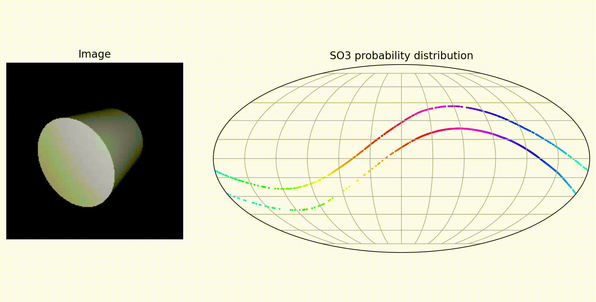
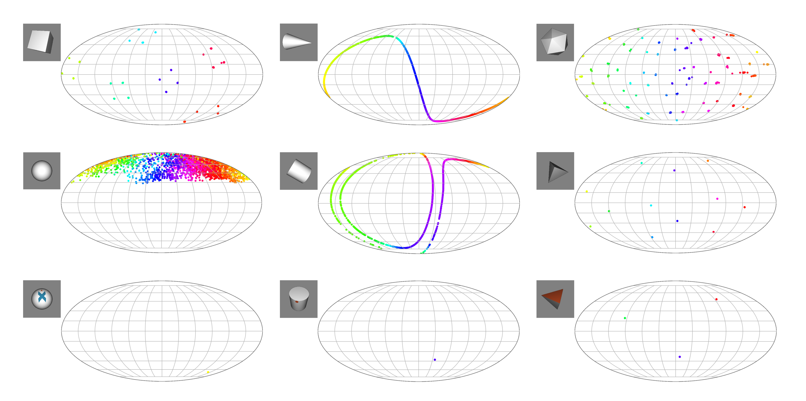

# Parallel Sampling of Diffusion Model on $SO(3)$

## Abstract
In this paper, we design an algorithm to accelerate the diffusion process on the $SO(3)$ manifold. The inherently sequential nature of diffusion models necessitates substantial time for denoising perturbed data. To overcome this limitation, we proposed to adapt the numerical Picard iteration for the $SO(3)$ space. We demonstrate our algorithm on an existing method that employs diffusion models to address the pose ambiguity problem. Moreover, we show that this acceleration advantage occurs without any measurable degradation in task reward. The experiments reveal that our algorithm achieves a speed-up of up to $4.9×$, significantly reducing the latency for generating a single sample.

## Table of Contents

- [Getting Started](#getting-started)
   - [Requirements](#requirements)
   - [Setup](#setup)
- [Experiments](#experiments)
   - [Training](#training)
   - [Evaluation](#evaluation)
   - [Results Visualization](#result-visualization)

## Getting Started

### Requirements
Ensure your system meets the following requirements: 
- Ubuntu (tested on Ubuntu 22.04)
- CUDA (tested with CUDA 11.8)

### Setup
1. **Create the conda virtual environment**
   ```
   conda create -n picard_pose python==3.11 -y
   conda activate picard_pose
   ```
2. **Install packages**

- Install PyTorch with cuda11.8:
   ```
   pip install torch torchvision --index-url https://download.pytorch.org/whl/cu118
   ```

- Install TensorFlow for the dataloader:
   ```
   pip install tensorflow tensorflow-datasets
   ```

- Install additional dependencies:
   ```
   pip install theseus theseus-ai
   pip install opencv-python
   ```

3. **Clone the repo**
   ```
   git clone https://github.com/pithreeone/liepose_pytorch.git
   cd liepose_pytorch
   ```

4. **Now you are ready to run the experiments. See [Experiments](#experiments).**

## Experiments

### Training
- Training a neural network for estimating object pose. (We also provide the pretrained model.)
   ```bash
   python3 -m src.trainer.run --config src/config/symsol.yaml --mode train
   ```

### Evaluation
- Evaluating and comparing the inference speed with Picard iteration.
   ```bash
   python3 -m src.trainer.run --config src/config/symsol.yaml --mode test
   ```

### Result Visualization
- Visualization of 2,000 samples generated by our algorithm with rotated cylinder.


- Visualization of 2,000 samples generated by our algorithm using images from the SYMSOL dataset.


## Acknowledgments
The authors gratefully acknowledge the support from the National Science and Technology Council (NSTC) in Taiwan under grant numbers MOST 111-2223-E-002-011-MY3, NSTC 113-2221-E-002-212-MY3, and NSTC 113-2640-E-002-003. The authors would like to express their appreciation for the donation of the GPUs from NVIDIA Corporation and NVIDIA AI Technology Center (NVAITC) used in this work. Furthermore, the authors extend their gratitude to the National Center for High-Performance Computing (NCHC) for providing the necessary computational and storage resources.
